# Pipeline SELIC × IPCA — juro real mensal no Databricks

Base analítica para acompanhar o custo do dinheiro frente à inflação, a partir
de duas séries públicas do Sistema Gerenciador de Séries Temporais (SGS) do
Banco Central do Brasil.

O pipeline vai da extração local da API até uma tabela Gold com juro real
mensal e taxas acumuladas em 12 meses, em arquitetura medalhão sobre Delta
Lake e Unity Catalog.

---

## 1. Arquitetura

```mermaid
flowchart LR
    A["API SGS/BCB<br/>séries 11 e 433"] -->|"extração local<br/>Python + retentativas"| B["data/raw<br/>selic.json · ipca.json"]
    B -->|"upload<br/>UI ou Databricks SDK"| C["Volume UC<br/>case_bcb.landing"]
    C -->|"Auto Loader<br/>availableNow"| D["Bronze<br/>bronze_sgs_raw"]
    D -->|"tipagem + MERGE<br/>idempotente"| E["Silver<br/>silver_series_bcb"]
    E -->|"agregação mensal<br/>Fisher + janela 12m"| F["Gold<br/>gold_juro_real_mensal"]
```



A extração roda **fora** do Databricks. O compute serverless do Free Edition
restringe a saída de rede a um conjunto limitado de domínios, e
`api.bcb.gov.br` não está entre eles. O caminho adotado é o previsto no
enunciado: extrair localmente, versionar o script, subir os arquivos brutos
para um Volume do Unity Catalog e fazer o pipeline ler do Volume.

Orquestração: Databricks Workflow `case_bcb_pipeline`, três tasks encadeadas
(`bronze` → `silver` → `gold`), compute serverless, código lido diretamente do
Git provider — o job executa sempre o commit da branch `main`, nunca uma cópia
solta no workspace.

---

## 2. Fontes de dados

| Série | Código SGS | Granularidade | Unidade | Registros (2020–2024) |
|---|---|---|---|---|
| SELIC | 11 | diária (dias úteis) | % ao dia | 1.255 |
| IPCA | 433 | mensal | % ao mês | 60 |

Ambas retornam `[{"data": "dd/MM/aaaa", "valor": "0.000"}]`, sem autenticação.

---

## 3. Estrutura do repositório

```
├── extract/                  Extração da API (roda no PC, fora do Databricks)
│   ├── bcb_client.py         Cliente HTTP com retentativas e backoff
│   ├── config.py             Metadados das séries
│   ├── extract_sgs.py        CLI de extração
│   └── upload_volume.py      Upload para o Volume via Databricks SDK
├── src/pipeline/             Lógica do pipeline (importada pelos notebooks)
│   ├── config.py             Catálogo, schema, tabelas e caminhos
│   ├── bronze.py             Ingestão incremental
│   ├── silver.py             Tipagem e MERGE
│   ├── gold.py               Agregação mensal
│   └── quality.py            Framework de checagens
├── notebooks/                Orquestração — só chamam os módulos
│   ├── 01_bronze.py
│   ├── 02_silver.py
│   └── 03_gold.py
├── sql/00_setup.sql          Criação de schema e volumes
├── databricks.yml            Asset Bundle: targets dev e prod
├── resources/                Definição declarativa do Workflow (YAML)
├── tests/                    Testes do cliente de extração
└── requirements.txt
```

Nenhuma regra de negócio vive em célula de notebook. Os notebooks importam
`src.pipeline` e apenas orquestram — o que torna o código testável fora do
Databricks e legível em diff no Git.

---

## 4. Decisões técnicas

### 4.1 A SELIC da série 11 é diária, não anualizada

Este é o ponto que mais afeta a corretude do resultado. A série 11 é publicada
em **% ao dia**. Compor essa taxa com o IPCA exige capitalização, não média.

A Gold entrega as duas leituras:

* `selic_media_dia` — média aritmética das taxas diárias do mês. É o que o
  enunciado pede literalmente, e serve para leitura direta;
* `selic_acum_mes` — taxa efetiva do mês, `∏(1 + taxa_dia) - 1`, capitalizando
  os dias úteis. **É esta que entra no juro real**, porque juros compõem; a
  média aritmética subestima o custo efetivo do dinheiro.

### 4.2 Juro real pela equação de Fisher

```
juro_real = ((1 + selic_mês) / (1 + ipca_mês)) - 1
```

E não a subtração `selic - ipca`, que só aproxima bem em taxas baixas e erra
justamente nos meses de inflação alta, que são os que interessam.

O produtório é calculado como `exp(Σ ln(1 + taxa))` — Spark não tem agregação
de produto, e a forma logarítmica é numericamente mais estável. É seguro aqui
porque `1 + taxa` é sempre positivo (nenhuma das séries chega a -100%).

### 4.3 Tabela única na Silver, com `serie_id` discriminando

O contrato das duas séries é idêntico (`data`, `valor`). Uma tabela só evita
duplicar código de MERGE, de checagem e de agregação. A identificação da série
vem do nome do arquivo de origem, preservado na Bronze.

### 4.4 Chave de negócio: `(serie_id, data_referencia)`

É o grão natural das duas séries — uma observação por dia útil na SELIC, uma
por mês no IPCA (sempre ancorada no dia 01). O `MERGE` por essa chave é a
garantia real de idempotência.

### 4.5 Duas camadas de proteção contra duplicação

| Cenário | Proteção |
|---|---|
| Reexecutar o job sem arquivo novo | Checkpoint do Auto Loader ignora arquivos já lidos |
| Reenviar o mesmo arquivo ao Volume | `MERGE` da Silver pela chave de negócio |
| Bronze com a mesma chave repetida | Deduplicação por `row_number()` antes do MERGE |

O checkpoint sozinho protege apenas o caso fácil. Quem garante a idempotência
de verdade é o MERGE. A deduplicação prévia existe porque o `MERGE` do Delta
falha com erro de múltiplas correspondências se a origem tiver a chave
repetida.

### 4.6 Conversão tolerante: `try_to_date` e `try_cast`

Devolvem `NULL` em vez de derrubar o job diante de um registro malformado. O
registro rejeitado vira métrica, e é a **checagem de qualidade** que decide se
o job para. Isso separa "erro de dado" de "erro de código" — e faz o job falhar
com uma mensagem que diz o que está errado, em vez de um stack trace de cast.

### 4.7 Gold reconstruída por sobrescrita

A Gold é uma agregação determinística da Silver. Reconstruir é idempotente por
definição e mais simples de auditar que um MERGE incremental. O histórico
continua acessível pelo time travel do Delta.

### 4.8 Zero retentativas no Workflow

As falhas que este job produz são de qualidade de dado, portanto
determinísticas: se a checagem reprovou, vai reprovar de novo. Retry serve para
falha transitória de infraestrutura, não para dado errado — repetir só gastaria
compute e atrasaria o alerta. A robustez a falha transitória está onde ela de
fato ocorre: no cliente HTTP da extração.

---

## 5. Grão e dicionário das tabelas

### `bronze_sgs_raw`
**Grão:** uma linha por registro bruto de arquivo ingerido.
Dado preservado como veio — todas as colunas de negócio são `STRING`.

| Coluna | Tipo | Descrição |
|---|---|---|
| `data_raw` | STRING | Data como veio da API (`dd/MM/aaaa`) |
| `valor_raw` | STRING | Valor como veio da API |
| `arquivo_origem` | STRING | Arquivo de origem no Volume |
| `arquivo_modificado_em` | TIMESTAMP | Modificação do arquivo no Volume |
| `ingerido_em` | TIMESTAMP | Momento da ingestão |

### `silver_series_bcb`
**Grão:** uma linha por série e data de referência.
**Chave de negócio:** `(serie_id, data_referencia)`.

| Coluna | Tipo | Descrição |
|---|---|---|
| `serie_id` | INT | 11 (SELIC) ou 433 (IPCA) |
| `serie_nome` | STRING | `selic` \| `ipca` |
| `granularidade` | STRING | `diaria` \| `mensal` |
| `data_referencia` | DATE | Data da observação |
| `ano_mes` | STRING | Competência `yyyy-MM` |
| `valor` | DECIMAL(18,8) | SELIC em % a.d.; IPCA em % a.m. |
| `arquivo_origem` | STRING | Procedência |
| `ingerido_em` | TIMESTAMP | Ingestão na Bronze |
| `processado_em` | TIMESTAMP | Processamento na Silver |

### `gold_juro_real_mensal`
**Grão:** uma linha por competência mensal (`ano_mes`) — 60 linhas.

| Coluna | Tipo | Descrição |
|---|---|---|
| `ano_mes` | STRING | Competência `yyyy-MM` |
| `competencia` | DATE | Primeiro dia do mês |
| `selic_media_dia` | DECIMAL | Média aritmética das taxas diárias (% a.d.) |
| `selic_dias_uteis` | INT | Dias úteis observados no mês |
| `selic_acum_mes` | DECIMAL | SELIC capitalizada no mês (% a.m.) |
| `ipca_mes` | DECIMAL | IPCA do mês (% a.m.) |
| `juro_real_mes` | DECIMAL | Juro real do mês, por Fisher (%) |
| `selic_acum_12m` | DECIMAL | SELIC acumulada em 12 meses (%) |
| `ipca_acum_12m` | DECIMAL | IPCA acumulado em 12 meses (%) |
| `juro_real_acum_12m` | DECIMAL | Juro real acumulado em 12 meses (%) |
| `meses_na_janela_12m` | INT | Meses efetivos na janela móvel |
| `processado_em` | TIMESTAMP | Momento da construção |

As colunas de 12 meses ficam nulas nos 11 primeiros meses da série, por
definição da janela móvel — não por falha. Há checagem garantindo que sejam
exatamente 49 competências preenchidas.

---

## 6. Checagens de qualidade

18 checagens no total, distribuídas nas três camadas. Toda violação levanta
`DataQualityError`, o que derruba a task e, por consequência, o Workflow.

**Bronze** — landing não vazio; tabela não vazia; procedência completa em toda
linha; as duas séries presentes; nenhuma linha totalmente nula (detecta leitura
com `multiLine` desligado).

**Silver** — chave de negócio única (`COUNT(*)` = `COUNT(DISTINCT chave)`);
zero registros rejeitados na tipagem; valores no domínio; janela temporal
respeitada; 60 competências de IPCA; IPCA sempre ancorado no dia 01; nenhum mês
com menos de 15 dias úteis de SELIC.

**Gold** — grão único; 60 competências; sem nulos obrigatórios; 49 acumulados
de 12 meses; identidade de Fisher reconferida algebricamente linha a linha;
cobertura mínima de dias úteis.

Duas merecem destaque:

* **Domínio da SELIC (0 a 1)** — a série 11 é % ao dia. Se alguém trocar pela
  série anualizada, o valor estoura o limite e o job cai, em vez de gerar um
  juro real silenciosamente errado. É a checagem que protege contra o erro
  conceitual mais provável neste pipeline.
* **Identidade de Fisher** — reconfere que
  `(1 + juro_real) × (1 + ipca) = (1 + selic)` em todas as linhas, com
  tolerância de 1e-6. Valida a álgebra do cálculo de forma independente de como
  ele foi implementado.

---

## 7. Evidência de idempotência

O pipeline foi executado duas vezes seguidas, sem alterar os arquivos do
Volume.

| Camada | 1ª execução | 2ª execução |
|---|---|---|
| Bronze — linhas ingeridas | 1.315 | 0 |
| Bronze — total na tabela | 1.315 | 1.315 |
| Silver — linhas inseridas | 1.315 | 0 |
| Silver — total na tabela | 1.315 | 1.315 |
| Gold — total na tabela | 60 | 60 |

Conferência independente:

```sql
-- Bronze: um único lote de ingestão por arquivo
SELECT arquivo_origem, COUNT(*) AS linhas, COUNT(DISTINCT ingerido_em) AS lotes
FROM workspace.case_bcb.bronze_sgs_raw
GROUP BY arquivo_origem;

-- Silver: linhas iguais a chaves de negócio distintas
SELECT COUNT(*) AS linhas,
       COUNT(DISTINCT serie_id, data_referencia) AS chaves
FROM workspace.case_bcb.silver_series_bcb;
```

---

## 8. Validação contra fonte externa

O `ipca_acum_12m` de dezembro de cada ano reproduz o IPCA oficial do ano
divulgado pelo IBGE, e o `selic_acum_12m` reproduz a Selic acumulada no ano.
É uma validação de ponta a ponta: se a extração, a tipagem ou a capitalização
estivessem erradas, estes números não fechariam.

| Ano | IPCA 12m (pipeline) | IPCA oficial | SELIC 12m | Juro real 12m |
|---|---|---|---|---|
| 2020 | 4,52 | 4,52 | 2,76 | −1,68 |
| 2021 | 10,06 | 10,06 | 4,42 | −5,12 |
| 2022 | 5,78 | 5,79 | 12,39 | 6,24 |
| 2023 | 4,62 | 4,62 | 13,04 | 8,05 |
| 2024 | 4,83 | 4,83 | 10,88 | 5,77 |

O juro real negativo em 2020 e 2021 e a virada a partir de 2022 refletem o
período de juro nominal no piso durante a pandemia, seguido do ciclo de aperto
monetário.

**Divergência conhecida em 2022 (5,78 contra 5,79).** O IBGE calcula a variação
anual a partir dos números-índice com precisão cheia; este pipeline capitaliza
as variações mensais já arredondadas em duas casas na publicação do SGS. Um
centésimo de diferença é o resultado esperado desse método, não um defeito de
implementação. Para eliminá-la seria necessário consumir a série de número-índice
do IPCA em vez da série de variação mensal.

---

## 9. Como reproduzir do zero

### 9.1 Extração local

```bash
git clone https://github.com/herberthalvees/case-bcb.git
cd case-bcb
pip install -r requirements.txt
python -m unittest discover -s tests -v     # 5 testes do cliente HTTP
python -m extract.extract_sgs               # gera data/raw/*.json
```

A CLI aceita `--serie`, `--data-inicial`, `--data-final`, `--output-dir`,
`--timeout` e `--max-tentativas`. Ela grava também um `_manifest.json` com
sha256, contagem e janela de datas de cada série — o que permite auditar se
duas extrações produziram o mesmo conteúdo.

O script trata erros de rede, retenta com backoff exponencial e jitter apenas
em status transitórios (408, 425, 429, 5xx) e falha explicitamente com
`BCBExtractionError` se a API não responder, devolver JSON inválido, payload
vazio ou registros sem os campos esperados. Os testes cobrem cada um desses
cenários com um servidor HTTP local.

### 9.2 Setup do Unity Catalog

Executar `sql/00_setup.sql` no SQL Editor: cria o schema `workspace.case_bcb` e
os volumes `landing` e `checkpoints`.

### 9.3 Carga dos arquivos no Volume

Pela UI (Catalog → `case_bcb` → `landing` → *Upload to this volume*) ou
automatizado:

```bash
export DATABRICKS_HOST=https://SEU-WORKSPACE.cloud.databricks.com
export DATABRICKS_TOKEN=dapi...
python -m extract.upload_volume --volume /Volumes/workspace/case_bcb/landing
```

### 9.4 Pipeline

Criar uma Git folder no workspace apontando para este repositório e executar o
Workflow `case_bcb_pipeline`, ou rodar os notebooks na ordem `01_bronze` →
`02_silver` → `03_gold`.

### 9.5 Deploy via Databricks Asset Bundle

O job está definido como código em `databricks.yml` e
`resources/case_bcb_pipeline.job.yml`. Em vez de recriar o Workflow pela UI:

```bash
databricks auth login --host https://SEU-WORKSPACE.cloud.databricks.com
databricks bundle validate
databricks bundle deploy -t dev
databricks bundle run case_bcb_pipeline -t dev
```

O bundle sincroniza os arquivos do repositório para o workspace e cria o job
com as três tasks encadeadas em serverless.

Dois targets estão definidos. Em `dev`, o modo *development* prefixa o nome do
job com o usuário, pausa o agendamento e isola os arquivos na pasta pessoal —
o deploy de trabalho nunca colide com o de produção. Em `prod`, o job recebe o
nome limpo, o agendamento ativo e os arquivos ficam em `/Workspace/Shared`,
sem depender de um usuário específico.

O JSON exportado da UI segue no repositório como registro do job criado
manualmente; a fonte da verdade passa a ser o YAML.

---

## 10. Estratégia de backfill

A janela extraída é parametrizada na CLI, e o pipeline é idempotente por chave
de negócio. Um backfill é, portanto, uma reexecução comum:

```bash
python -m extract.extract_sgs \
    --data-inicial 01/01/2015 --data-final 31/12/2019 \
    --output-dir data/backfill_2015_2019
```

Renomear os arquivos antes do upload (`selic_2015_2019.json`) preserva o
mapeamento por prefixo e faz o Auto Loader tratá-los como arquivos novos. O
MERGE da Silver absorve o histórico sem duplicar nada que já exista, e a Gold é
reconstruída por completo, recalculando as janelas de 12 meses com a série
estendida.

Duas ressalvas ao ampliar a janela:

* as checagens de completude são parametrizadas por `QTD_MESES_ESPERADA`,
  `ANO_MES_INICIAL` e `ANO_MES_FINAL` em `src/pipeline/config.py` e precisam ser
  ajustadas junto;
* o domínio da SELIC (0 a 1 % a.d.) foi calibrado para o período recente e
  precisa de revisão em janelas históricas com juro nominal muito mais alto.

---

## 11. Limitações e evoluções possíveis

* **Lakeflow Declarative Pipelines (ex-DLT).** As expectativas declarativas
  substituiriam boa parte de `quality.py` com menos código. A implementação
  atual foi mantida em Structured Streaming por dar controle explícito sobre a
  mensagem de falha e por ser testável fora do Databricks.
* **Parametrização de catálogo e schema por target.** O bundle já isola dev de
  prod pelo nome do job e pelo caminho dos arquivos, mas as duas versões
  escrevem no mesmo schema. O passo natural é passar catálogo e schema como
  parâmetros do job, lidos por widget nos notebooks, para que `dev` grave num
  schema próprio.
* **Série de número-índice do IPCA**, para eliminar a divergência de
  arredondamento descrita na seção 8.
* **Dias não úteis na SELIC.** A série 11 não publica finais de semana e
  feriados. A capitalização mensal usa apenas os dias publicados, que é o
  tratamento correto para a taxa efetiva, mas vale explicitar em qualquer
  consumo posterior.
